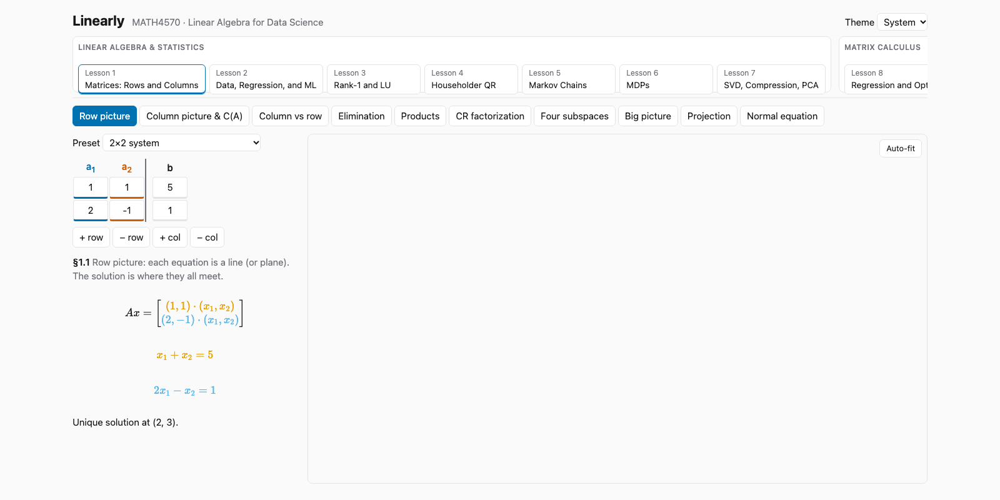

# Linearly

Interactive visualizations for **MATH4570 — Linear Algebra for Data Science**. Course notes explain each idea with static figures; Linearly turns them into scenes where you change the inputs and watch the geometry respond.



## Lessons

**Part I — Linear Algebra & Statistics**

| # | Lesson | Highlights |
|---|--------|------------|
| 1 | Matrices: Rows and Columns | Row/column pictures, elimination, CR factorization, four subspaces, projection |
| 2 | Data, Regression, and ML | Least squares as projection of Y onto C(X), normal equation |
| 3 | Rank-1 and LU | Products as sums of rank-1 matrices, LU / LDU / PA = LU |
| 4 | Householder QR | Reflectors, QR least squares, conditioning vs. Gram–Schmidt |
| 5 | Markov Chains | Chain editor, Pᵗx₀ evolution, eigendecomposition, stationary distribution |
| 6 | MDPs | Gridworld, Bellman equation, policy iteration |
| 7 | SVD, Compression, PCA | Low-rank image compression, PCA, dimension reduction |

**Part II — Matrix Calculus**

| # | Lesson | Highlights |
|---|--------|------------|
| 8 | Regression and Optimization | Quadratic forms, definiteness, gradients, gradient descent |

## Getting started

Requires Node.js 20+.

```bash
npm install
npm run dev        # start the dev server
```

| Script | Purpose |
|--------|---------|
| `npm run dev` | Vite dev server with hot reload |
| `npm run build` | Typecheck and build to `dist/` |
| `npm run preview` | Serve the production build |
| `npm run typecheck` | TypeScript only |
| `npm test` | Run the Vitest suite |

## Tech stack

- **React 19** + **TypeScript**, built with **Vite**
- **three.js** via `@react-three/fiber` / `drei` for 2D and 3D canvases
- **KaTeX** for math rendering
- **fraction.js** for exact rational arithmetic — results stay exact when the numbers allow, and switch to labeled floating point when they don't
- **Zustand** for state

## Project layout

```
src/
  core/          math core (matrices, LU, QR, eigen, SVD/PCA, Markov, MDP, ...) + tests
  components/    shared UI: matrix editor, canvases, charts, layout
  lessons/       one lazy-loaded module per lesson (lesson1 … lesson8)
  presets/       example systems and datasets from the course notes
  store/         Zustand stores
  theme/         colors and theming
  workers/       web workers for heavy computation
```
